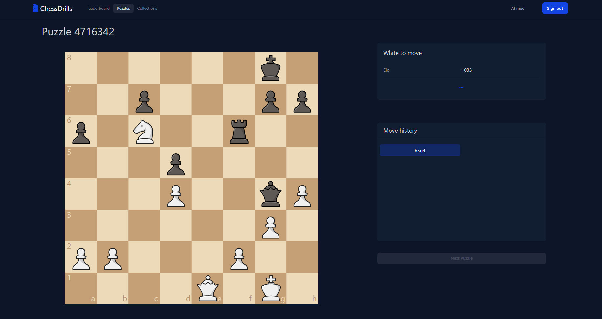
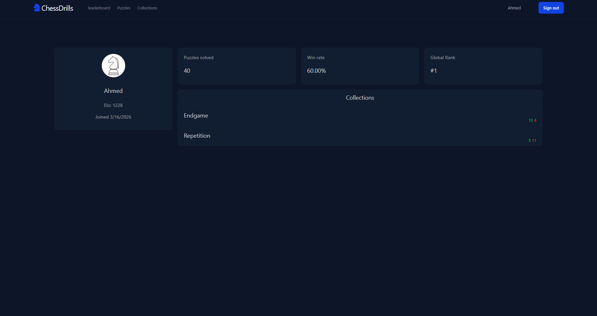

# ChessDrills

A tool to practice chess. inspired by the woodpecker method, improve your chess ability by solving a group of puzzles repetitively. 

Create an account, solve puzzles and improve your rankings on the leaderboard! 


 






## About this project

This full stack project uses:
- [Postgresql](https://www.postgresql.org/) using [drizzle ORM](https://orm.drizzle.team/)  for the database
- [Express.js](https://expressjs.com/) for the backend
- [React](https://react.dev/) for the frontend
- [Better-Auth](https://better-auth.com/) for authentication
- [Tailwindcss](https://tailwindcss.com/) and [daisy ui](https://daisyui.com/) for styling


## Running this project locally

To run this project you will need github and docker

First, clone this repository:
```
git clone https://github.com/mo7medehab/ChessDrills.git
```

Then go to the file location and run docker compose:
```
docker compose up --build
```

you can access this website at localhost:5137